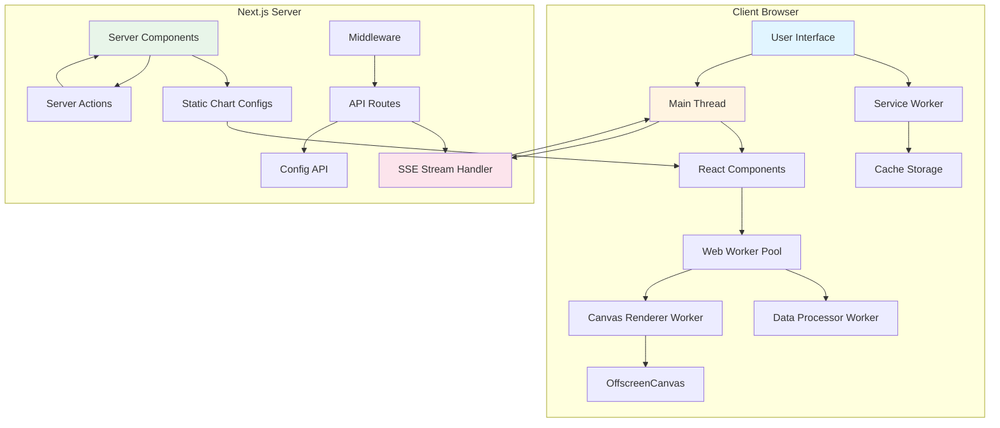
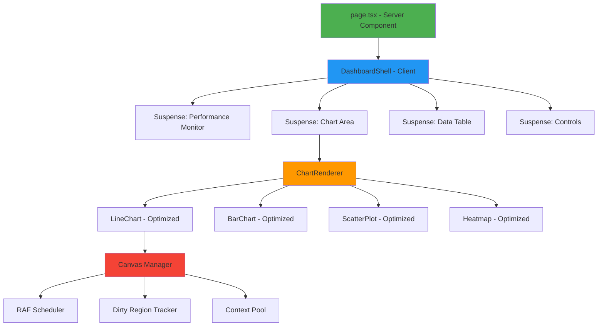
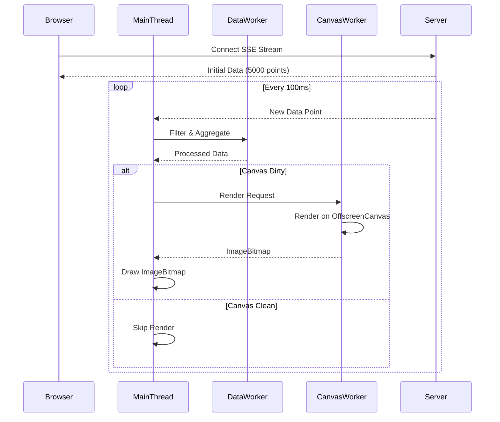
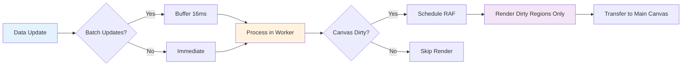
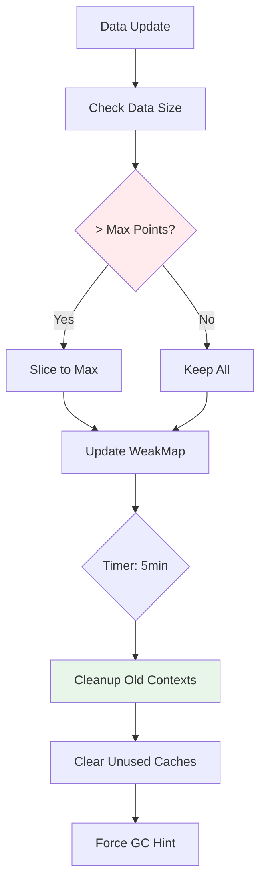
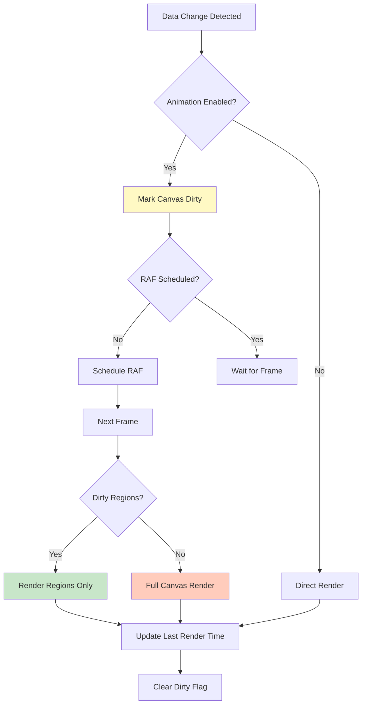
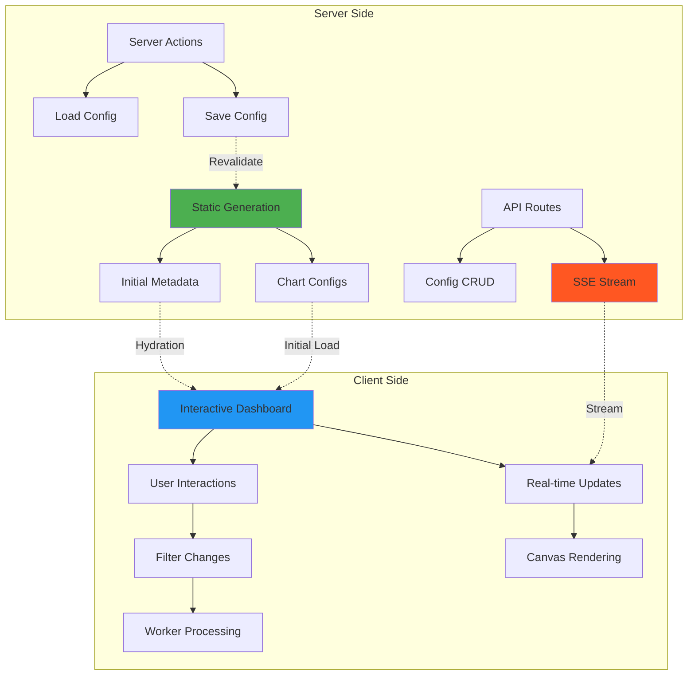
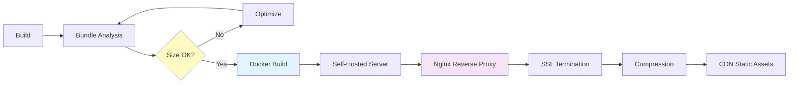
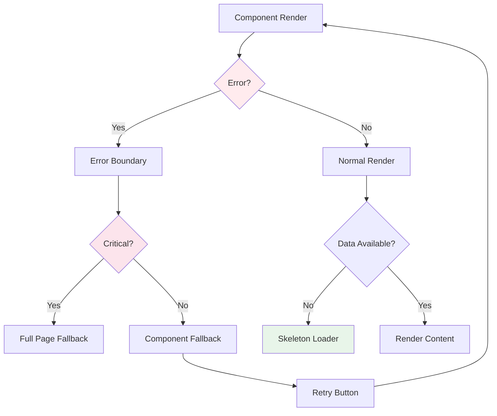
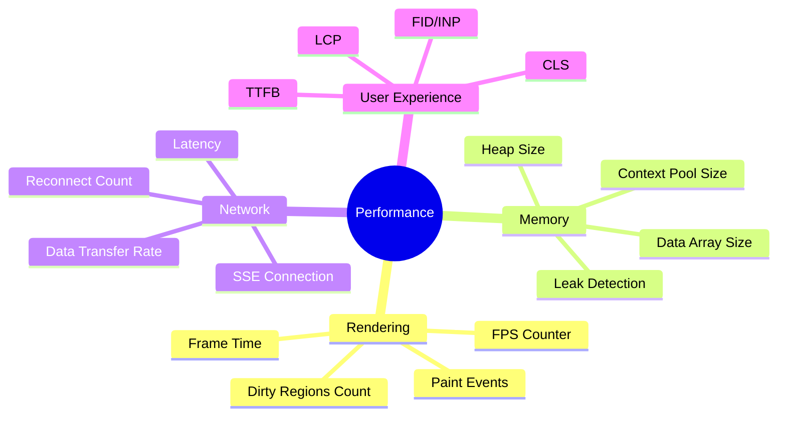

# Performance Dashboard - Production Architecture

## System Architecture Overview



## Component Hierarchy



## Data Flow Architecture



## Performance Optimization Strategy



## Memory Management Strategy



## Canvas Rendering Pipeline



## Server/Client Boundary



## Bundle Structure

```
dist/
├── app/
│   ├── page.js                    # Server Component (2KB)
│   └── dashboard/
│       ├── page.js                # Server Component (3KB)
│       └── layout.js              # Server Layout (1KB)
├── chunks/
│   ├── vendors.js                 # React, Next.js (150KB)
│   ├── charts.js                  # Chart components (45KB)
│   ├── ui-components.js           # UI lib (35KB)
│   └── dashboard-client.js        # Dashboard logic (50KB)
├── workers/
│   ├── data-processor.js          # Data worker (15KB)
│   └── canvas-renderer.js         # Canvas worker (12KB)
└── static/
    └── config/
        └── charts/
            └── *.json             # Static configs (5KB)
```

## Production Deployment Flow



## Error Handling & Fallbacks



## Performance Monitoring Points



## Core Web Vitals Optimization

| Metric | Strategy | Implementation |
|--------|----------|----------------|
| **LCP** | Server Components, Suspense, Font optimization | Server-side chart config loading, Critical CSS inlining |
| **FID/INP** | Web Workers, useTransition, Event throttling | All data processing off main thread, Non-blocking UI updates |
| **CLS** | Fixed dimensions, Skeleton loaders | Canvas with fixed size, No dynamic layout shifts |
| **TTFB** | Edge runtime, Middleware, Caching | Edge API routes, Response compression |

## Technology Stack

```
┌─────────────────────────────────────────────────┐
│                   Browser                       │
├─────────────────────────────────────────────────┤
│ React 19 + Next.js 15 App Router               │
│ • Server Components                             │
│ • Client Components (selective)                 │
│ • useTransition / useDeferredValue              │
├─────────────────────────────────────────────────┤
│ Canvas API + OffscreenCanvas                    │
│ • 2D Context with optimization flags            │
│ • ImageBitmap transfer                          │
│ • Dirty region tracking                         │
├─────────────────────────────────────────────────┤
│ Web Workers                                     │
│ • Data processing worker                        │
│ • Canvas rendering worker                       │
│ • Shared Array Buffer (optional)                │
├─────────────────────────────────────────────────┤
│ Performance APIs                                │
│ • requestAnimationFrame                         │
│ • requestIdleCallback                           │
│ • PerformanceObserver                           │
│ • Memory API                                    │
└─────────────────────────────────────────────────┘
```

## Key Performance Patterns

### 1. Render Batching
```typescript
// Batch multiple data updates into single render
const batchUpdates = (updates: DataPoint[]) => {
  requestIdleCallback(() => {
    startTransition(() => {
      setData(prevData => [...prevData, ...updates]);
    });
  }, { timeout: 50 });
};
```

### 2. RAF Throttling
```typescript
// Limit renders to 60fps max
let rafId: number | null = null;
const scheduleRender = () => {
  if (rafId !== null) return;
  rafId = requestAnimationFrame(() => {
    render();
    rafId = null;
  });
};
```

### 3. Dirty Region Optimization
```typescript
// Only re-render changed regions
const updateRegion = (region: DOMRect) => {
  ctx.clearRect(region.x, region.y, region.width, region.height);
  renderRegion(region);
};
```

### 4. Context Pooling
```typescript
// Reuse canvas contexts
const getContext = (canvas: HTMLCanvasElement) => {
  return contextPool.get(canvas) || createOptimizedContext(canvas);
};
```

### 5. Memory Limits
```typescript
// Enforce data size limits
const addData = (newData: DataPoint[]) => {
  const combined = [...existingData, ...newData];
  return combined.slice(-MAX_DATA_POINTS);
};
```

---

## Production Checklist

### Pre-Deployment
- [ ] All Suspense boundaries tested
- [ ] Error boundaries handle all cases
- [ ] Memory profiling complete (no leaks)
- [ ] Bundle size analyzed and optimized
- [ ] Core Web Vitals all green
- [ ] Cross-browser testing complete

### Self-Hosted Setup
- [ ] Node.js server configured
- [ ] Nginx reverse proxy set up
- [ ] SSL certificates installed
- [ ] Compression enabled (gzip/brotli)
- [ ] Health check endpoint active
- [ ] Monitoring tools configured
- [ ] Log rotation set up
- [ ] Backup strategy defined

### Performance Verification
- [ ] 60 FPS @ 10k points sustained
- [ ] < 100ms interaction latency
- [ ] < 1MB/hour memory growth
- [ ] No memory leaks over 8 hours
- [ ] Lighthouse score > 90

---

This architecture ensures maximum performance, proper separation of concerns, and production-ready reliability.